### Test1 : New User Verification  
**_Screenshot/gif_** 
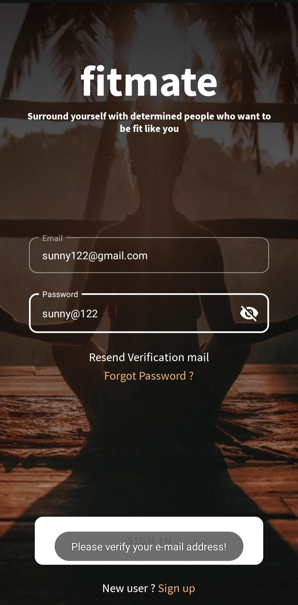 
**_Expected Result_**:  It denied my login as I was a new User 
**_Actual Result_**: Positive 

### Test2 : Verifying already registered user  
**_Screenshot/gif_**   
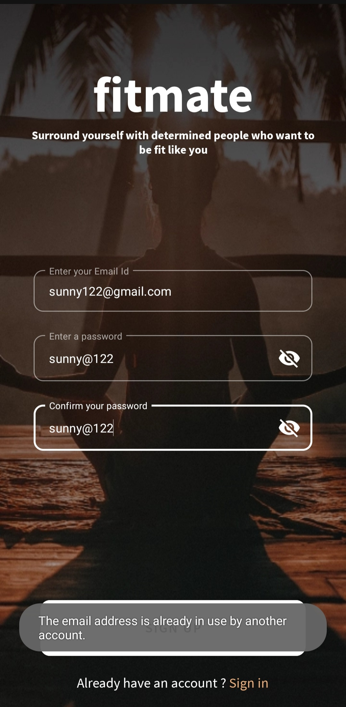 
**_Expected Result_**:  It gave me a message that this email is already registered 
**_Actual Result_**:  Positive 
     
### Test3 : SignUp 
**_Screenshot/gif_**   
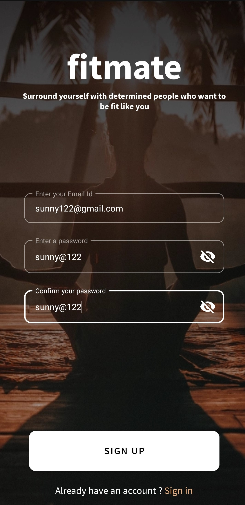 
**_Expected Result_**:  SignUp successful 
**_Actual Result_**:  Positive 

### Test4 : SignIn  
**_Screenshot/gif_**   
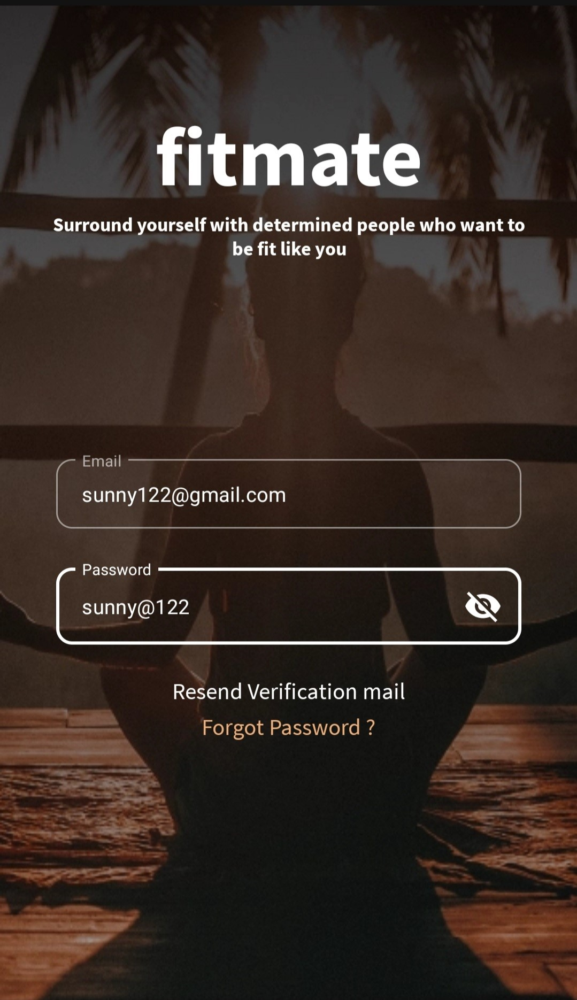 
**_Expected Result_**:  SignIn successful 
**_Actual Result_**:  Positive 

     
### Test5 : Empty Fields
**_Screenshot/gif_**   
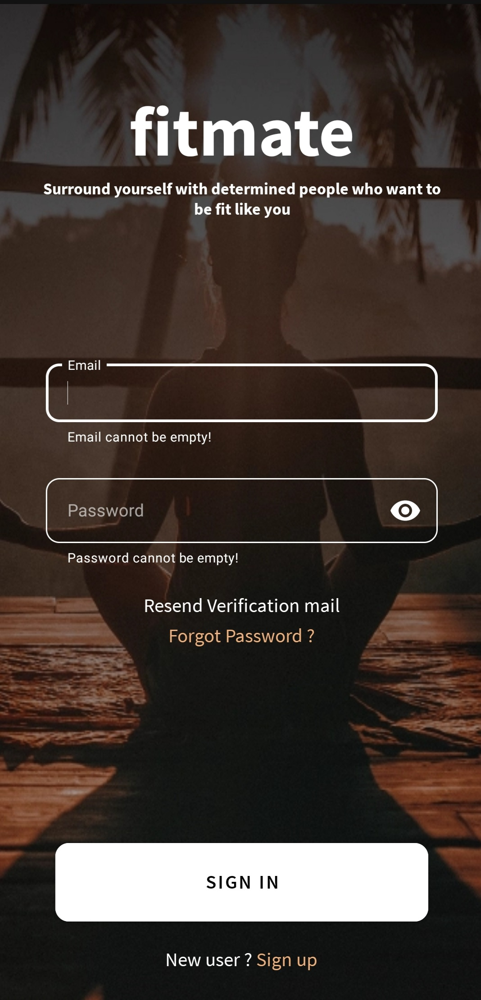 
**_Expected Result_**: Email and Password cannot be empty 
**_Actual Result_**:  Positive 
     
### Test6 : Password Constraints in sign Up 
**_Screenshot/gif_**   
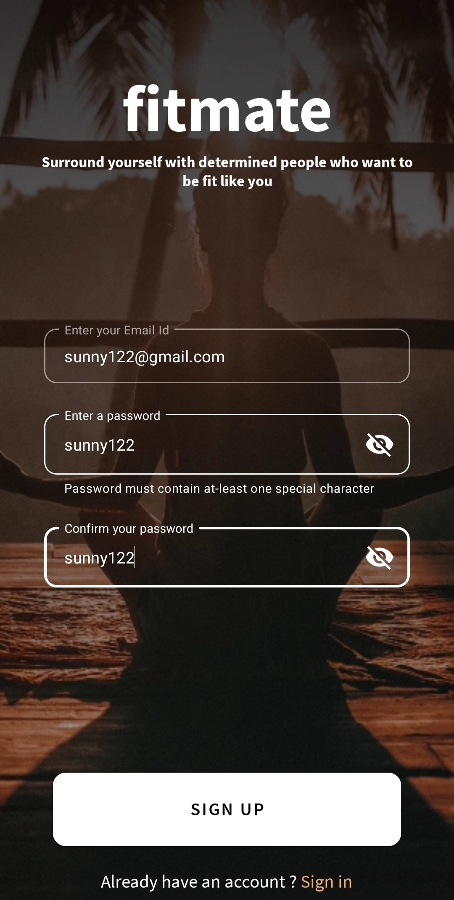 
      
    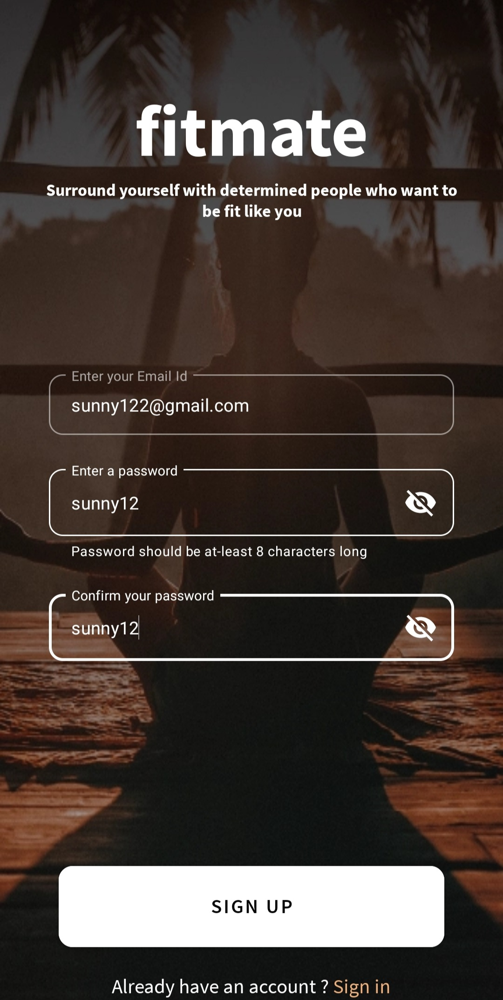 
**_Expected Result_**:  Password must contain atleast one special character and minimum 8 digits 
**_Actual Result_**:  Positive 
     

### Test7 : Resend Verification Email  
**_Screenshot/gif_**   
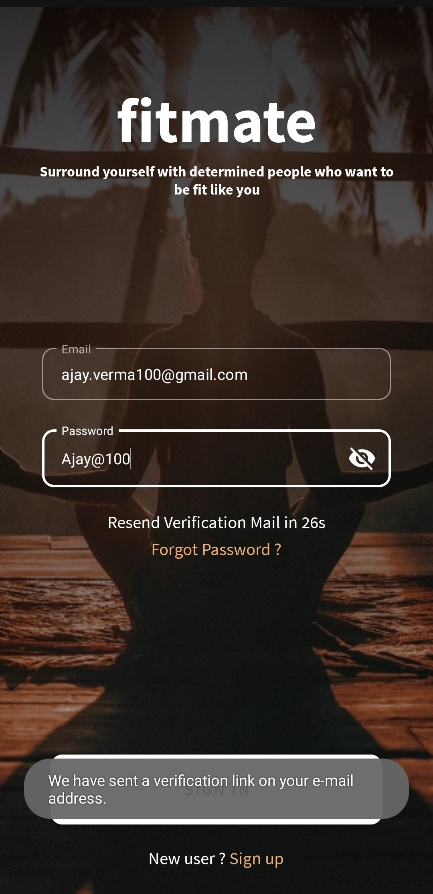 
**_Expected Result_**: An verification link has been sent to your email address 
**_Actual Result_**:  Positive 

### Test8 : Forgot Password
**_Screenshot/gif_**   
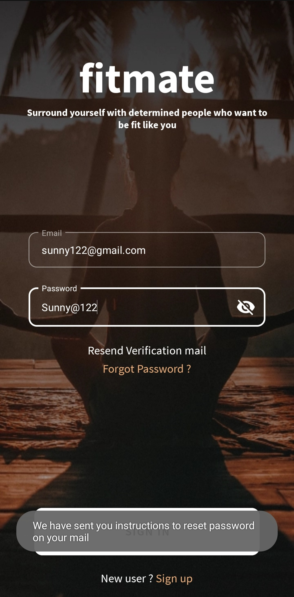 
**_Expected Result_**: Instructions for resetting password has been sent to your email address 
**_Actual Result_**:  Positive 

### Test9 : Failed Login Attempts
**_Screenshot/gif_**    
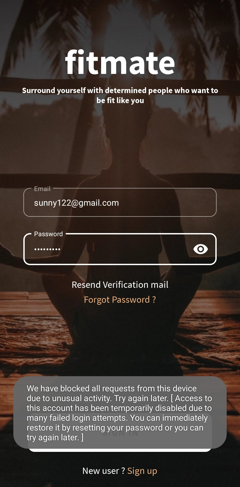 
**_Expected Result_**: I tried sign in with incorrect credentials for 3 times only but it says we have blocked all requests from this device due to many failed login attempts . 
**_Actual Result_**:  Negative (In case someone not intentionally try to sign in with wrong credentials then in that case this is an issue) 

### Test10 : Badly Formatted Email
**_Screenshot/gif_**   
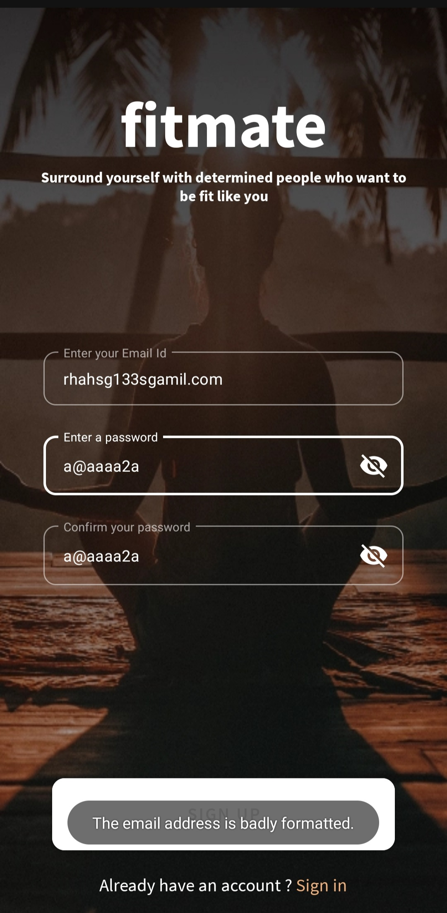 
**_Expected Result_**: Email should have been accepted 
**_Actual Result_**:  Negative (Someone can have this type of email id )  

### Test11 : Badly Formatted Email2
**_Screenshot/gif_**   
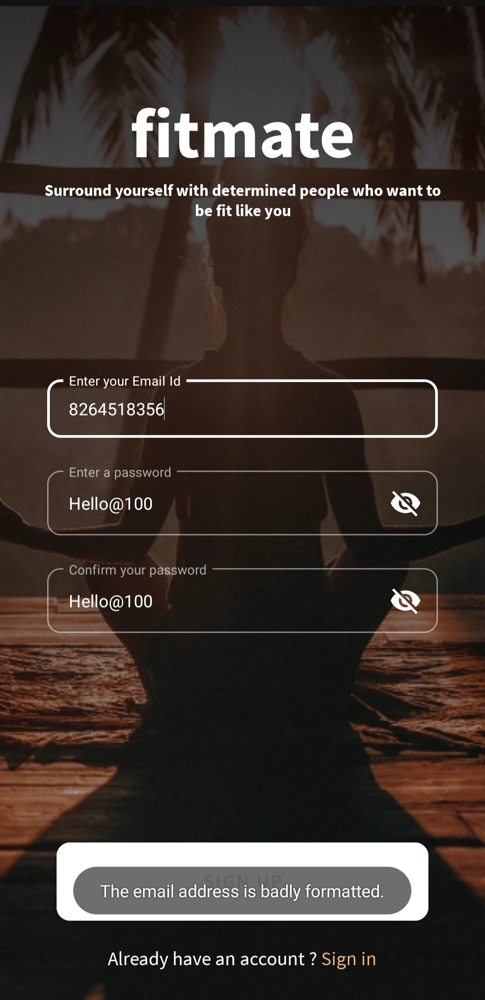 
**_Expected Result_**: When I try to use phone number in case of email it says badly formatted email , number should also be a way to sign in  
**_Actual Result_**:  Negative      

### Test12 : Passwards Do Not Match
**_Screenshot/gif_**   
 
**_Expected Result_**: When I tried sign Up with different entries in 'password' and 'Confirm Password' it says passwords does not match 
**_Actual Result_**:  Positive      

### Test13 : Email Already in Use 
**_Screenshot/gif_**   
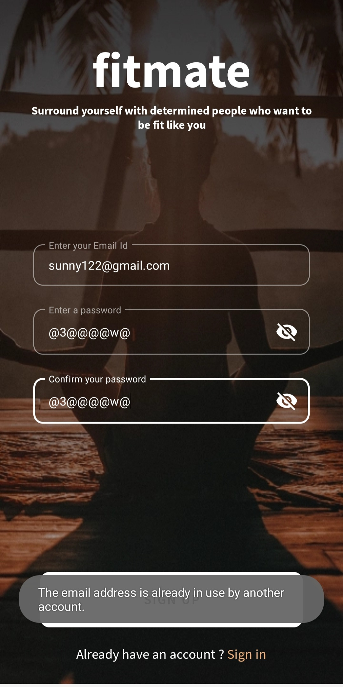 
**_Expected Result_**: When I tried sign Up with already registered email it says email already in use 
**_Actual Result_**:  Positive    

### Test14 : Password must contain Atleast 1 Letter  
**_Screenshot/gif_**   
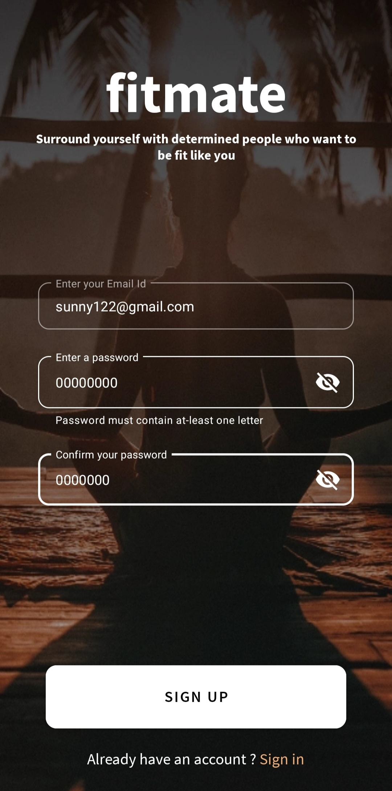 
**_Expected Result_**: Password must contain atleast one letter 
**_Actual Result_**:  Positive      

### Test15 : Password must contain Atleast 1 Digit  
**_Screenshot/gif_**    
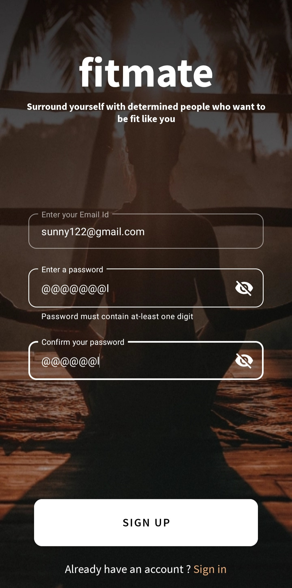 
**_Expected Result_**: Password must contain atleast one digit 
**_Actual Result_**:  Positive      
