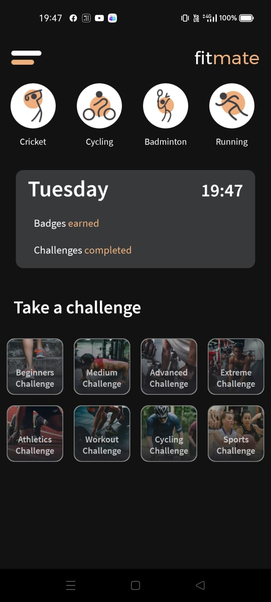
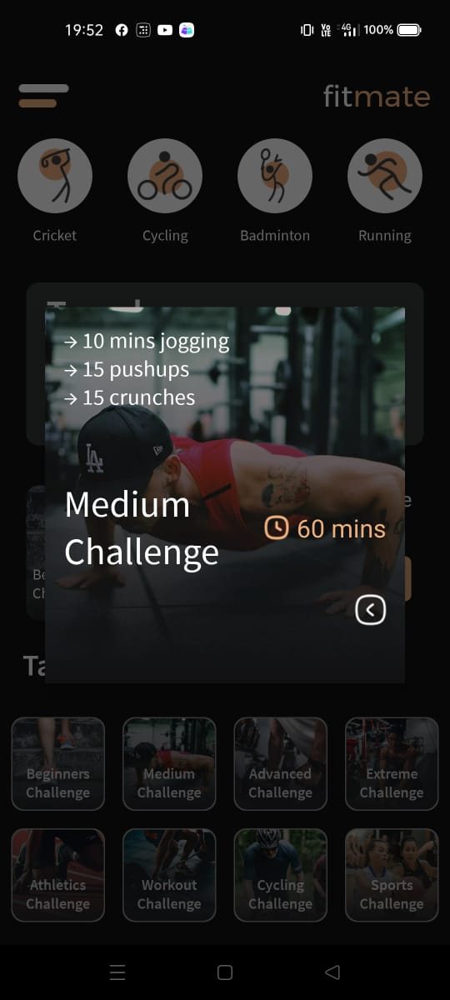

* _ Test1 Description_  
Taking up various challenges available on the dashboard

     _Screenshot/gif_:  
     
     
     
     
     
     
     
     
     
     
     
     
     
     
     
     
     
     
     
     
     
     
     
     
     
     
     
     
     _Expected Result_: All challenges should open along with timer 

     _Actual Result_: All challenges opened and the timer was working fine

* _Test2 Description_  
Single challenge can be opened at a time

     _Screenshot/gif_:  
     
      
      
      

     _Expected Result_: While one challenge is in progress, the other challenges cannot be started

     _Actual Result_:  While one challenge is in progress, the other challenges cannot be taken

* _Test3 Description_  
After completion of one challenge, **challenges completed** section should update

     _Screenshot/gif_:  
     
     
    

     _Expected Result_: Challlenge Completed section and badges earned sections should update after completion of a challenge

     _Actual Result_:  There is no update and it is not clickable. No changes observed in the section of **challenges completed** and **badges earned**

